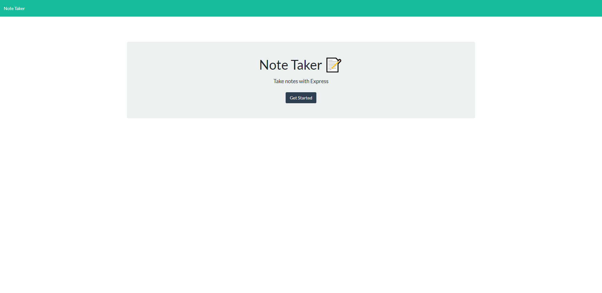
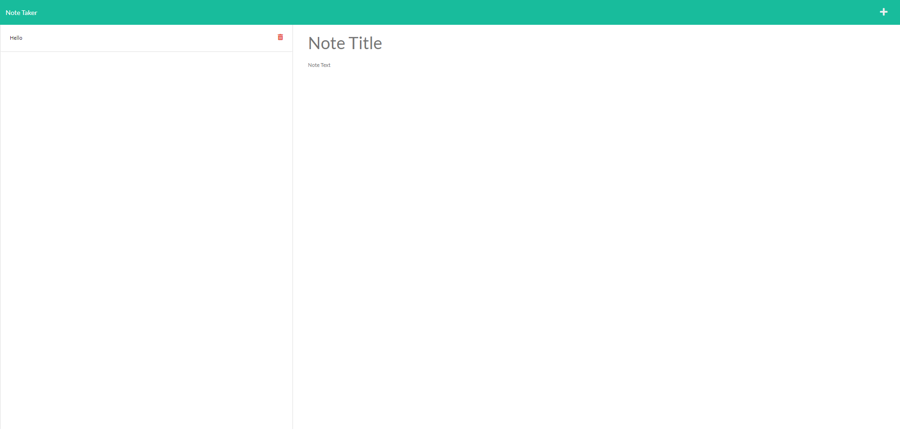

# note-take

## Description
An app for creating, saving, and editing and deleting text notes.

## Technologies Used
* Nodes.js
* Express.js
* Heroku CLI
* Javascript
* HTML
* CSS

## Installation
Server must have Node.js installed.  Run "npm i" frpm the root directory to install and run "npm start" to start the webserver.

## GitHub Repository and Heroku Link
[GitHub Repository](https://github.com/adambowers09/note-take)

[Heroku](https://note-keeper-09.herokuapp.com/)

## Usage
[Link to video of deployed app](https://drive.google.com/open?id=1CE493VvJ1JKWNJkbDWUjzh3owDUeJRrz&authuser=adambowers09%40live.com&usp=drive_fs)

## Screenshots

